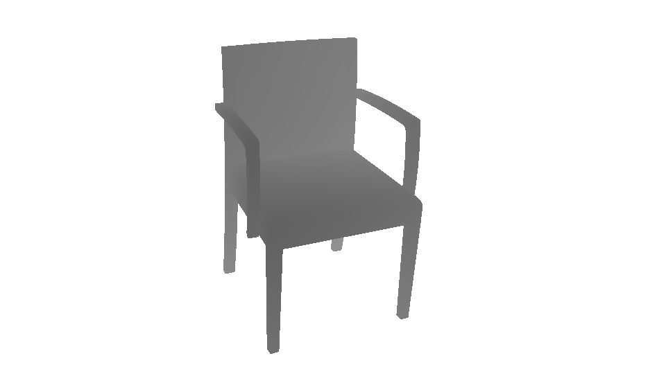

# Blender script for rendering ShapeNet models

This repo contains the implementation of Blender Python script for rendering 
ShapeNet obj files

## example:

### rendered rgb images with random background images

</a>


### rendered depth images:

</a>

### pose:

```text
4.374694554125504453e-01 -4.180723275263726890e-01 7.961381881998743637e-01 1.691706400439716873e+00
8.974623655743290129e-01 1.474515273040246655e-01 -4.157154855070874788e-01 -8.246252502494784142e-01
5.640734111112344351e-02 8.963668844113694689e-01 4.397097116636921044e-01 9.232025044714089468e-01
0.000000000000000000e+00 0.000000000000000000e+00 0.000000000000000000e+00 1.000000000000000000e+00
```
this matrix contains rotation matrix and translation vector, transforms coordinates from 
object coordinates to camera coordinates(actually is original camera pose to rotated camera 
pose since Blender computes everything in world coordinates system). I've verified the rotation 
matrix using CPP [Eigen](http://eigen.tuxfamily.org/index.php?title=Main_Page) library, Python
[Tansforms3d](https://pypi.org/project/transforms3d/) library, CPP [Opencv](https://opencv.org/) 
library, but if im wrong, plz let me know.  

## useage for Python code

### 0. requirement

Python 3.5

Blender 2.79

ShapeNet Dataset(if not, you need to modify the code yourself)

background images(recommend PASCAL VOC)

### 1. configuration file

**you need to change the settings.py file before you run the python file!!!**

all the configurations needed are in '''settings.py''', you need to set your own:  
- ShapeNet dataset path: ```g_shapenet_path```
- Blender executable path: ```g_blender_excutable_path```


and other configurations you might want to change:
- background image folder path: ```g_background_image_path```
- synthetic rgb image folder path: ```g_syn_rgb_folder```
- synthetic depth image folder path: ```g_syn_depth_folder```
- pose folder: ```g_syn_pose_foloder```

for more configuration informations, plz refer to [Blender API Document](https://docs.blender.org/api/2.79/)
### 2. viewpoint file

All txt files in the folder view_points are viewpoints file, you can generate new viewpoints file using [render for cnn](https://github.com/ShapeNet/RenderForCNN)
- you can change the the camera clip distance by modifying varibale ```distance_min``` and ```distance_max``` in ```RenderForCNN/blob/master/render_pipeline/kde/sample_viewpoints.m```, 

- and view point number generated per categlory by modifying ```num_samples``` in ```RenderForCNN/blob/master/render_pipeline/kde/run_sampling.m```

### 3. start rendering

```text
python run_render.py
```

this command will render the rgb, depth image and generate pose file.
